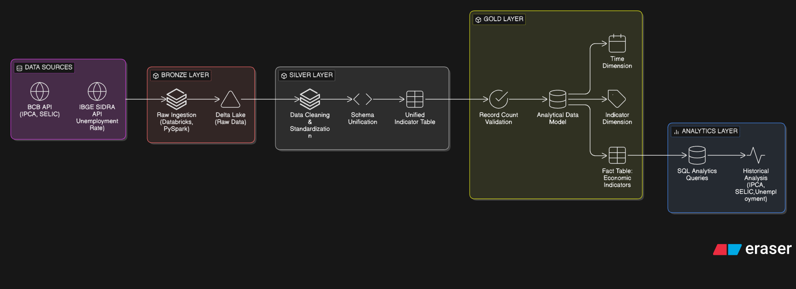
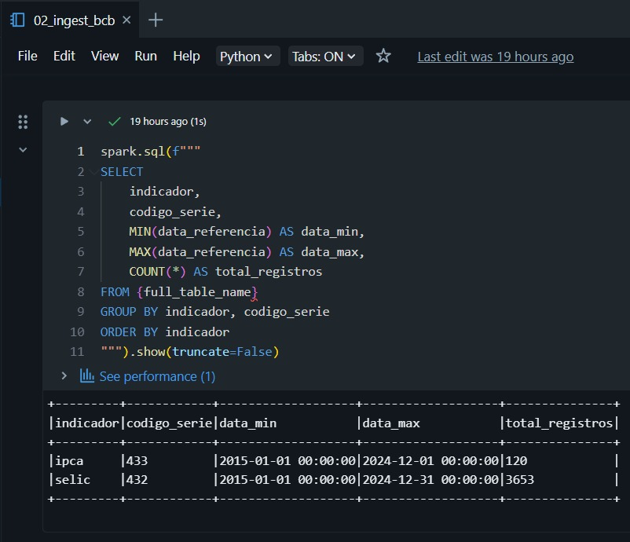
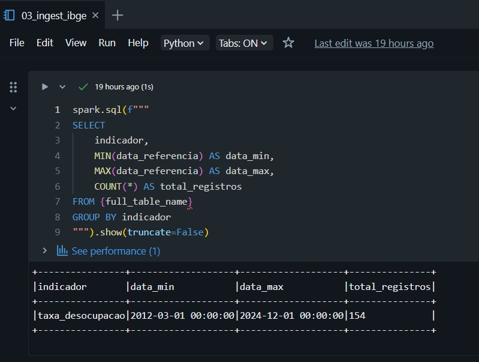
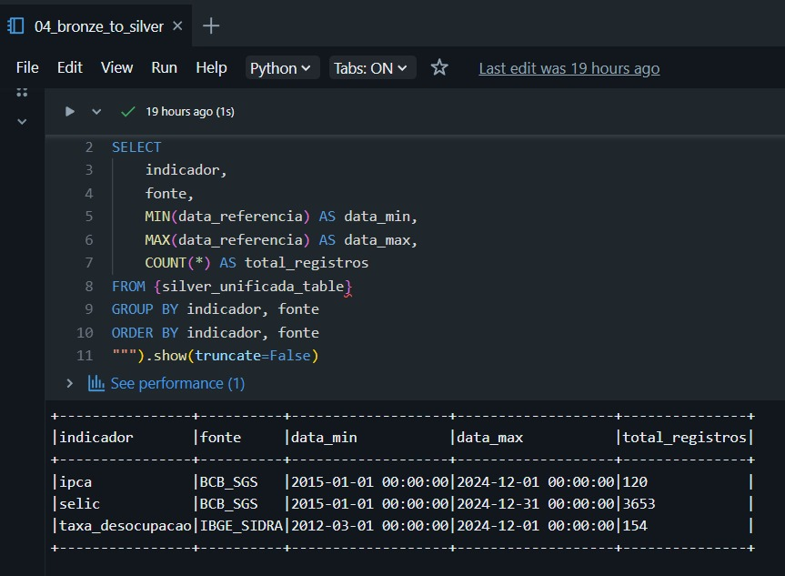
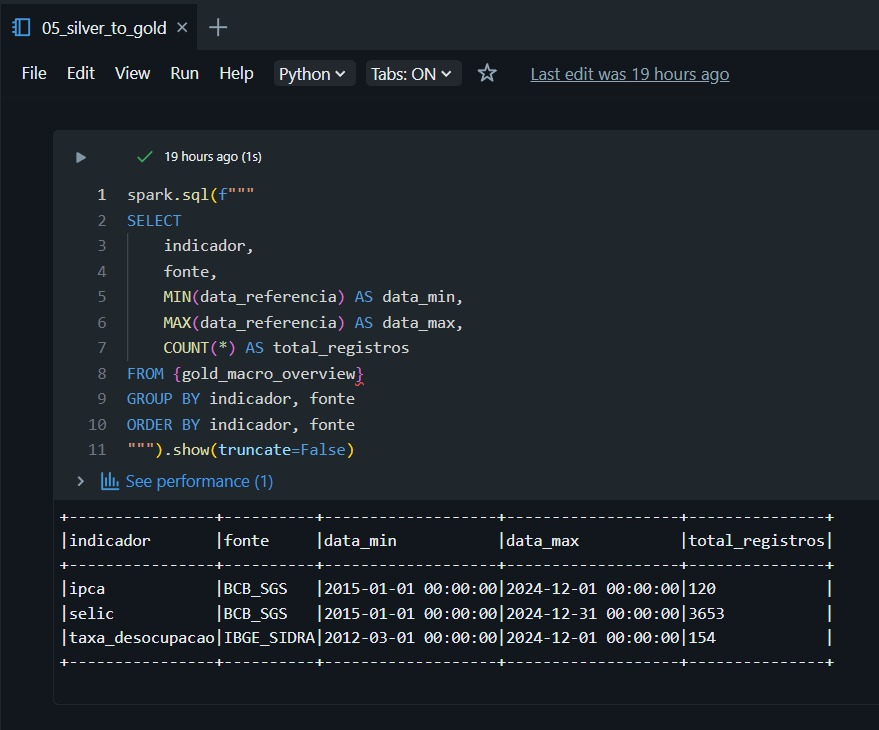
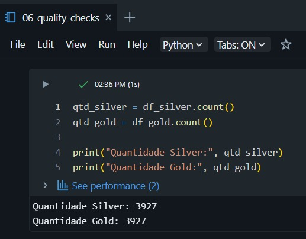
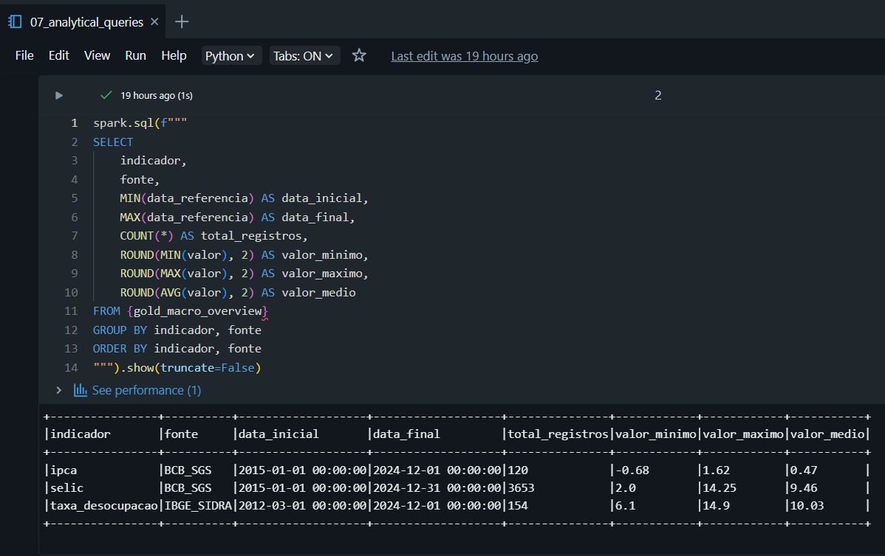

# Brazil Economic Data Platform


Pipeline de engenharia de dados desenvolvido em **Databricks + PySpark** utilizando arquitetura **Medallion (Bronze → Silver → Gold)** para ingestão, transformação e análise de indicadores macroeconômicos do Brasil.

O projeto integra dados de duas fontes oficiais:

* Banco Central do Brasil (BCB / SGS)
* IBGE (SIDRA)

Indicadores utilizados:

* IPCA
* Taxa SELIC
* Taxa de Desocupação

---

# Arquitetura do Projeto



O pipeline segue o padrão **Medallion Architecture (Bronze → Silver → Gold)**, onde os dados são ingeridos em estado bruto, transformados e padronizados na camada Silver, e modelados analiticamente na camada Gold para consumo analítico.
---

# Estrutura do Projeto

```
01-notebooks
├── 02_ingest_bcb
├── 03_ingest_ibge
├── 04_bronze_to_silver
├── 05_silver_to_gold
├── 06_quality_checks
└── 07_analytical_queries

02-docs
└── images
```

---

# Pipeline de Dados

## Bronze Layer

### Fonte BCB (IPCA e SELIC)



### Fonte IBGE (Taxa de Desocupação)



---

## Silver Layer

Tabela unificada com os indicadores econômicos.



---

## Gold Layer

Modelo analítico consolidado com:

* dimensão tempo
* dimensão indicador
* fato indicadores
* visão analítica macroeconômica



---

# Quality Checks

Validações implementadas:

* verificação de valores nulos
* verificação de duplicidade
* consistência de volume entre Silver e Gold
* validação de intervalo temporal
* análise de faixa de valores



---

# Análises Geradas

Exemplo de consulta analítica sobre os indicadores.



---

# Tecnologias Utilizadas

* Databricks
* PySpark
* Delta Lake
* SQL
* APIs públicas (BCB / IBGE)

---

# Autor

Wendel Mata  
Data Engineering Student

LinkedIn:
https://www.linkedin.com/in/wendel-mata-b31633206/
